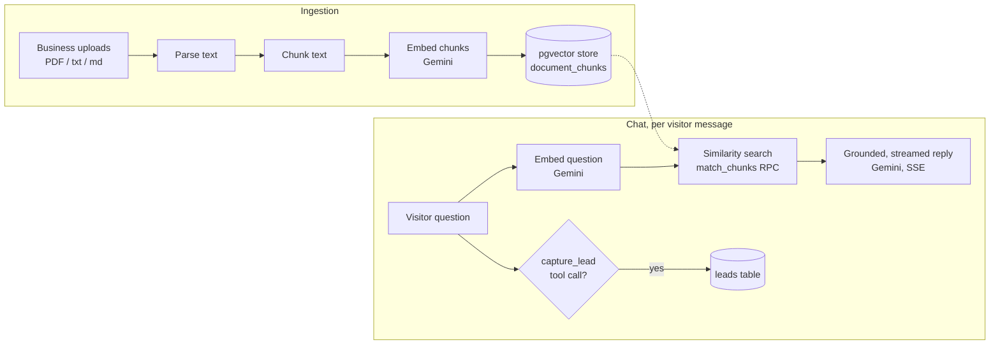

# frontdesk.ai

[](https://github.com/mhm655/ai-support-agent/actions/workflows/backend-ci.yml)
[](https://github.com/mhm655/ai-support-agent/actions/workflows/frontend-ci.yml)
[](LICENSE)

An AI front desk for small businesses. A business uploads what they already
have — hours, pricing, policies, FAQs — and gets an AI agent that answers
customer questions grounded in that content, captures leads, and embeds on
their own site with one `<script>` tag.

**Live**: [ai-support-agent-liard.vercel.app](https://ai-support-agent-liard.vercel.app)

**Try it live, no signup**: [ai-support-agent-liard.vercel.app/demo](https://ai-support-agent-liard.vercel.app/demo) — chat with a pre-seeded agent directly.

> A portfolio project, built end to end (backend, frontend, RAG pipeline,
> deployment) to explore a real retrieval-augmented generation product, not
> just a toy demo.

<!-- DEMO GIF: 15-30s clip of the embeddable widget on the demo page —
     open the widget, ask a question grounded in an uploaded document
     (e.g. "do you accept Cigna?"), show the streamed reply appear token
     by token, then show a follow-up message that gets a lead captured
     (name/email) and appears in the dashboard Leads tab a moment later. -->

## Screenshots

<!-- SCREENSHOT: landing page hero (dark navy/amber, animated chat
     transcript) — first impression, captures the visual design work -->

<!-- SCREENSHOT: agent detail page, Documents tab, with at least one
     document showing status "done" — proves the RAG ingestion pipeline
     actually runs, not just that a form exists -->

<!-- SCREENSHOT: agent detail page, Test Chat tab, mid-conversation with
     a grounded answer visible (a question whose answer clearly comes
     from an uploaded document, not a generic LLM guess) — proves
     retrieval is actually grounding the reply -->

## What it does

- A business signs up, creates an agent, and uploads documents (PDF/txt/md)
  describing their business.
- Those documents are parsed, chunked, embedded, and stored in Postgres
  (pgvector).
- Customers chat with the agent — via the dashboard's test panel, or via the
  embeddable widget on the business's own site — and get answers grounded in
  the uploaded content, not generic guesses.
- If a customer shows interest in booking or being contacted, the agent
  captures their name/email/phone as a lead, automatically, mid-conversation.
- The business gets a dashboard: documents, leads, conversation history, and
  basic analytics.

## Stack

| Layer | Tech |
|---|---|
| Frontend | Next.js (App Router), Tailwind CSS v4, TypeScript |
| Backend | FastAPI, Python |
| Database / Auth / Storage | Supabase (Postgres + pgvector, Auth, Storage) |
| AI | Gemini (`gemini-3.5-flash-lite` for chat + function calling, `gemini-embedding-2` for embeddings) via the `google-genai` SDK |
| Hosting | Vercel (frontend + embeddable widget), Railway (backend API) |

## Architecture, briefly

Two apps, one Supabase project:

```
frontend/   Next.js dashboard (agent config, documents, leads, analytics)
            + the public embeddable widget (frontend/public/widget.js)
backend/    FastAPI — owns authorization and the RAG/chat pipeline
```

The backend is the authorization boundary — it verifies the Supabase JWT
per-request and scopes every query to the caller's business, rather than
relying on Supabase Row Level Security as the primary guard. The one
deliberately unauthenticated route is the public chat endpoint the
embeddable widget calls, since it has to work from a visitor's browser on a
completely different website with no Supabase session available.

RAG pipeline: upload → extract text → chunk → embed (Gemini) → store in
pgvector → similarity search against the visitor's question → grounded,
streamed reply, with lead capture running as a function-calling tool in the
same pass.

Full architectural detail and the reasoning behind the non-obvious decisions
lives in [`ARCHITECTURE.md`](ARCHITECTURE.md).



## Lessons learned / issues hit

Real problems hit during development, not hypothetical ones:

- **Gemini free-tier quota wall.** `gemini-3.5-flash`'s free tier on this
  project caps at 20 requests/day (each chat message costs 2 calls), which
  silently crashed the SSE stream with an unhandled 500 once exhausted.
  Fixed by switching the chat model to `gemini-3.5-flash-lite` (Google's
  higher-volume free tier) and adding a proper `error` SSE event end-to-end
  — backend catch block → `lib/chat.ts` → `TestChatTab` → `widget.js` — so
  any future API failure surfaces as a readable message instead of a dead
  connection.
- **Supabase key format mismatch.** This project's Supabase instance issues
  the newer `sb_secret_...` / `sb_publishable_...` key format, but the
  pinned `supabase-py==2.9.1` client only validates the older legacy
  `service_role`/`anon` JWT-style key format (`eyJ...`). The fix was using
  the legacy keys (Supabase dashboard → API Keys → "Legacy anon,
  service_role API keys" tab), not the new-format ones the dashboard shows
  by default.
- **RLS bypass isn't the same as table privileges.** RLS is enabled on
  every table, but `service_role` still needs explicit grants beyond RLS
  bypass (`GRANT ALL ON ALL TABLES/SEQUENCES IN SCHEMA public TO
  service_role`, plus matching `ALTER DEFAULT PRIVILEGES`) — without this,
  every backend query failed with `permission denied for table X` even
  though `service_role` is supposed to bypass RLS entirely.
- **Accessibility gaps in the original forms.** Inputs with no associated
  `<label>`, no visible focus states, and a destructive document-delete
  with no confirmation dialog — all fixed during a design pass.

## Running locally

Backend ([full instructions](backend/README.md)):

```bash
cd backend
python -m venv venv
venv\Scripts\activate            # source venv/bin/activate on macOS/Linux
pip install -r requirements.txt
cp .env.example .env             # fill in Supabase + Gemini values
uvicorn app.main:app --reload --port 8000
```

Frontend:

```bash
cd frontend
npm install
cp .env.local.example .env.local # fill in Supabase values
npm run dev
```

Needs a Supabase project with pgvector enabled, a private Storage bucket
named `documents`, and a Gemini API key — see `backend/.env.example` and
`frontend/.env.local.example` for the exact variables.

## Testing

Backend (pytest, fully offline — every Supabase/Gemini call is mocked):

```bash
cd backend
pip install -r requirements.txt -r requirements-dev.txt
pytest
```

Frontend unit tests (Vitest + React Testing Library):

```bash
cd frontend
npm test
```

Frontend end-to-end tests (Playwright, runs against a production build with
no real backend — see `frontend/playwright.config.ts` for what that does and
doesn't cover):

```bash
cd frontend
npx playwright install --with-deps chromium   # first time only
npm run build
npm run test:e2e
```

## CI/CD

GitHub Actions runs on every push and pull request to `main`:

- [`.github/workflows/backend-ci.yml`](.github/workflows/backend-ci.yml) —
  installs backend deps on Python 3.11 and 3.12, then runs the pytest suite.
- [`.github/workflows/frontend-ci.yml`](.github/workflows/frontend-ci.yml) —
  lints, type-checks, runs unit tests, builds, then runs the Playwright e2e
  suite against that build.

Both run on every push and pull request to `main` (no path filtering — a
required check that a path filter skips can block a PR forever, so it isn't
worth the tradeoff at this repo's size). Vercel and Railway auto-deploy on
push to `main` independently of these workflows — to
actually gate deploys on tests passing, turn on GitHub branch protection for
`main` requiring these checks (Settings → Branches → Branch protection
rules), so a broken PR can't be merged in the first place.

## Deploying

See [`DEPLOYMENT.md`](DEPLOYMENT.md) for the full Vercel + Railway setup.
